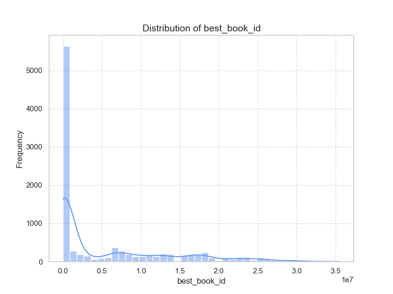
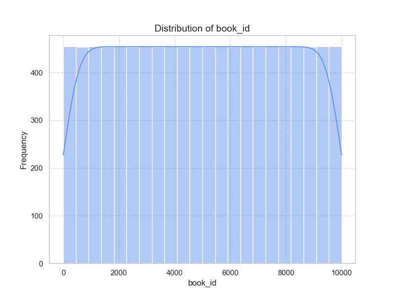
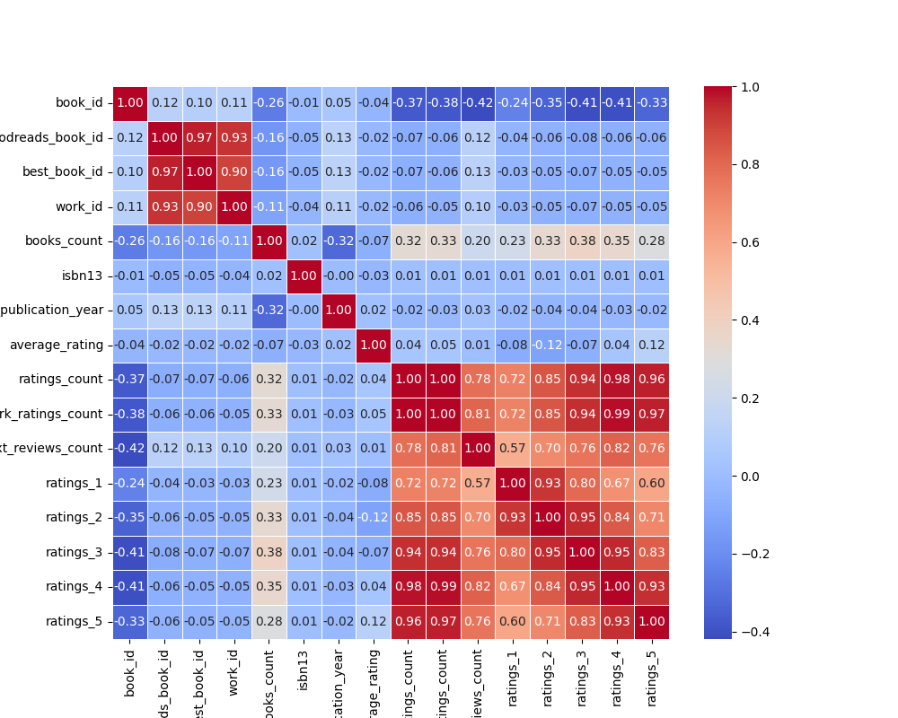
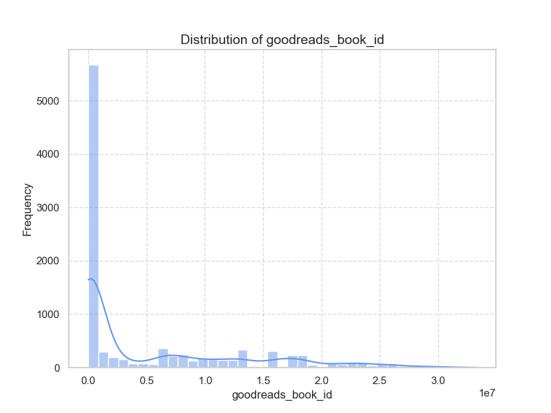

The data from 'goodreads.csv' reveals various interesting trends and statistics about a sample of 10,000 books in the Goodreads database. Below is a summary of the findings based on the provided summary statistics, missing values, and correlation matrix:

### Summary Statistics:

1. **Book IDs and Identifiers**:
   - The dataset includes unique identifiers for each book such as `book_id`, `goodreads_book_id`, `best_book_id`, and `work_id`, all having a count of 10,000 entries with ranges that indicate broad diversity within the dataset.

2. **Books Count**:
   - On average, each author has contributed to about 75.71 books, with a wide standard deviation (170.47), indicating a handful of authors with significantly high counts.

3. **Original Publication Year**:
   - The mean publication year is 1982, with a range from -1750 (implying historical works) to 2017. This indicates a mix of very old literature and contemporary works. 

4. **Ratings**:
   - The average book rating is approximately 4.00, highlighting that this dataset is likely skewed towards popular or well-received books. The ratings reflect a wide range in user ratings across 1 to 5 stars.

5. **Review Counts**:
   - The number of ratings and work ratings indicates active engagement, with `ratings_count` averaging around 54,001 and `work_ratings_count` averaging 59,687. However, there's a significant variation shown in their standard deviations, suggesting a small number of works receive disproportionately high attention.

6. **Authors**:
   - There are 4664 unique authors in the dataset. The top author, Stephen King, appears 60 times, indicating a notable concentration in authors who dominate the dataset.

### Missing Values:

- The dataset has missing values in some fields:
  - **ISBN and Original Title**: A considerable number of entries are missing ISBNs and original titles (700 and 585 entries, respectively) which could affect any analyses related to specific editions of books.
  - **Language Code**: With 1084 missing entries, insights into linguistic diversity and trends could be limited.

### Correlation Analysis:

- **Negative Correlations**:
  - Notably strong negative correlations exist between `ratings_count` and several fields such as `books_count`, `work_text_reviews_count`, indicating authors with more books tend to have fewer ratings per book on average, which requires further exploration.
  - The `average_rating` shows a weak correlation with `ratings_count`, suggesting that popular books may not always maintain the highest ratings, pointing to potential biases in how newer books might be rated.

- **Positive Correlations**:
  - Strong positive relationships between the various ratings (1 to 5 stars), indicating that if a book receives high ratings in one category, it is likely to receive high ratings in others.

### General Trends and Areas Needing Further Analysis:

1. **Concentration of Ratings**:
   - Investigate why certain books receive drastically more ratings than others. This could involve looking into marketing, author popularity, or social media influences.

2. **Impact of Publication Year**:
   - Explore trends over time regarding book ratings: Are older books consistently rated higher than newer ones, or is there a resurgence of interest in contemporary literature?

3. **Missing Values Handling**:
   - Develop strategies to handle missing ISBNs and language codes, as these are crucial for comprehensive analysis and comparisons across editions and linguistic reach.

4. **Author Contributions**:
   - Analyze the distribution of books per author more deeply. Are certain authors dominating due to sheer quantity, while others achieve similar levels of engagement with fewer works? Understanding author impact versus popularity could yield insights into literary trends.

5. **Genre Analysis**:
   - Performing a genre classification and its subsequent effect on ratings and reviews could provide deeper insights into the preferences of Goodreads users, potentially linking genre-specific trends with publication years.

6. **Content Quality versus Popularity**:
   - Conduct an analysis comparing average ratings against the number of reviews to understand if books with more reviews are favored or if this is merely a function of visibility. 

In conclusion, while the dataset presents valuable insights into book ratings and reviews, further analysis is necessary to uncover deeper trends and issues, especially around why certain books and authors rise to prominence over others.

Based on the provided correlation matrix, several key relationships stand out:

### Key Variables with Significant Correlations:

1. **Ratings Count**
   - **Highly correlated with:**
     - `work_ratings_count` (0.995)
     - `work_text_reviews_count` (0.779)
     - All individual ratings (`ratings_1` to `ratings_5` range from 0.723 to 0.978)
   - **Significance**: `ratings_count` is a fundamental measure of how many ratings a book has received, which directly influences and indicates its popularity and visibility on platforms like Goodreads.

2. **Work Ratings Count**
   - **Highly correlated with:**
     - `ratings_count` (0.995)
     - `work_text_reviews_count` (0.807)
     - Individual ratings (`ratings_1` to `ratings_5`)
   - **Significance**: This variable indicates the total engagement with the work across all ratings and comments. A higher count may imply that the book is often read and discussed, enhancing its visibility.

3. **Work Text Reviews Count**
   - **Highly correlated with:**
     - `work_ratings_count` (0.807)
     - `ratings_count` (0.779)
     - Individual ratings
   - **Significance**: Text reviews suggest deeper engagement than simple ratings. They often provide qualitative insight into readers' thoughts, which can also affect future readers’ choices.

4. **Individual Ratings (1 to 5)**
   - **Highly correlated with each other:** For example, `ratings_1` to `ratings_2` (0.926), `ratings_2` to `ratings_3` (0.949), etc.
   - **Significance**: High correlations suggest that readers tend to rate books consistently. A trend in lower ratings across all categories could indicate poorer reception, while higher ratings indicate satisfaction or quality.

5. **Books Count**
   - **Moderately correlated with:**
     - `ratings_count` (0.324)
     - `work_ratings_count` (0.333)
   - **Significance**: The total count of books by an author or within a series can impact the visibility and rating of a particular book, potentially due to an established fan base or the author’s reputation.

### Possible Causal Relationships:

- **Increased Ratings Count → Increased Work Ratings Count**: More people rating a book could lead to an increase in work ratings, as more interactions are directly tied to the book’s perceived popularity.
  
- **Higher Ratings Count and Work Ratings Count → Higher Ratings in Each Category**: As a book accumulates more ratings, it may increase its likelihood of receiving higher ratings overall. This might be due to the “bandwagon effect,” where more people feel compelled to rate positively after seeing others do so.

- **Positive Engagement (Work Text Reviews) → Higher Ratings Count**: More text reviews might indicate greater reader engagement and investment in the book, which could correlate with higher ratings and overall satisfaction.

- **Original Publication Year Impact**: While the correlation is weaker (around 0.05-0.15), an older publication date can lead to increased `ratings_count` as more time allows for more readers to engage with the book. However, there is a negative correlation with `books_count`, suggesting newer publications might struggle to gain traction in a crowded market.

### Conclusion:

This analysis indicates that reader engagement measures such as total ratings count, work ratings count, and text reviews significantly correlate with each other and collectively influence perceived quality through individual ratings. Their interrelations suggest that a vibrant interaction with a book (via ratings and reviews) builds positive momentum for visibility and acceptance within the reading community.

