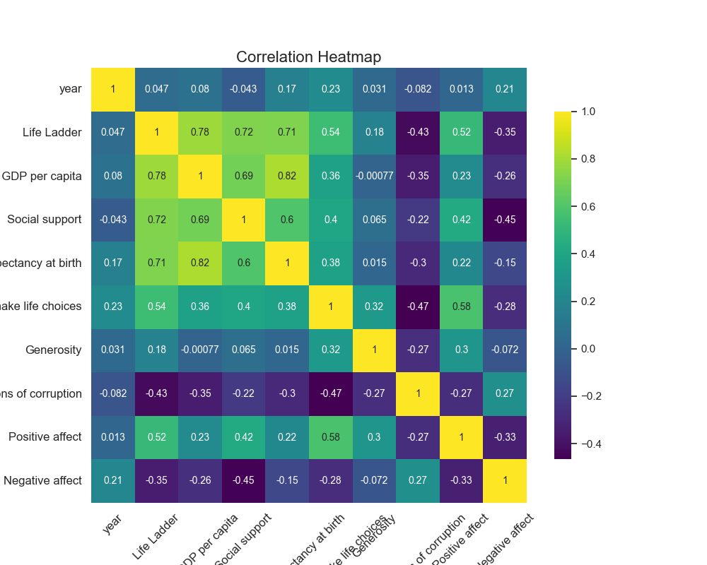

Based on the analysis of the data provided from 'happiness.csv', here is a summary of the findings, general trends, and areas that might require further exploration:

### Summary Statistics:
1. **Countries Represented:**
   - **Total Observations:** 2363 entries covering data from 165 unique countries.
   - **Most Frequent Country:** Argentina with 18 entries.

2. **Years:**
   - **Range:** Data spans from 2005 to 2023.
   - **Mean Year:** Approximately 2014.76, indicating a concentration of data points around the mid-2010s.

3. **Happiness Metrics:**
   - **Life Ladder (Happiness Score):** Mean score of 5.48, with a range from 1.281 to 8.019. Most values lie below 6.5.
   - **Log GDP per Capita:** Average of approximately 9.40, indicating economic prosperity on a logarithmic scale.
   - **Social Support:** Average score is 0.809 with values ranging from 0.228 to 0.987, showing a generally high level of perceived social support.
   - **Healthy Life Expectancy at Birth:** Average life expectancy of 63.40 years, with a maximum of 74.6 years.
   - **Freedom to Make Life Choices:** Averaging 0.75, which suggests a perceived high level of autonomy among individuals.
   - **Generosity:** Average of nearly zero (9.77e-05), showing little tendency toward generosity as measured here.
   - **Perceptions of Corruption:** Average score of 0.744, indicating some level of perceived corruption, but generally on the lower end (closer to 0 is worse).
   - **Positive and Negative Affect:** Positive affect averages around 0.652 while negative affect is 0.273, indicating a generally favorable emotional state.

### Missing Values:
- Various indicators show missing values:
  - **Log GDP per Capita:** 28 missing
  - **Social Support:** 13 missing
  - **Healthy Life Expectancy:** 63 missing
  - **Freedom to Make Life Choices:** 36 missing
  - **Generosity:** 81 missing
  - **Perceptions of Corruption:** 125 missing
  - **Positive Affect:** 24 missing
  - **Negative Affect:** 16 missing
These missing values could affect the accuracy of the analysis and insights derived from them.

### Correlation Insights:
- **Strongest Correlations with Happiness (Life Ladder):**
   - **Log GDP per Capita (0.78)**: Suggests a significant relationship between economic prosperity and happiness.
   - **Social Support (0.72)**: Indicates that social support is closely tied to reported happiness levels.
   - **Healthy Life Expectancy at Birth (0.71)**: Higher life expectancy is positively associated with happiness.
   - **Freedom to Make Life Choices (0.54)**: A moderate correlation that suggests a degree of autonomy contributes to happiness.

- **Negative Correlations:**
   - **Perceptions of Corruption (-0.43)**: Higher perceived corruption is associated with lower happiness.
   - **Negative Affect (-0.35)**: Increased feelings of negative affect are inversely related to happiness.

### General Trends:
- There is a clear relationship between GDP per capita, social support, and happiness, suggesting that improving economic conditions and social interactions may enhance overall happiness.
- Societal factors like perceived corruption and negative emotional experiences contribute significantly to lower happiness levels, raising concerns about governance and social policies.

### Areas for Further Analysis:
1. **Impact of Missing Data**: Investigate how the missing values influence correlations and overall trends. Implement alternatives for imputation or removal strategies to analyze their impacts.
  
2. **Temporal Trends**: Examine changes in happiness levels over the years by analyzing trends by year to identify shifts in public sentiment, especially around significant global events.
  
3. **Country-Level Comparisons**: Analyze specific countries to see how happiness correlates with different socio-economic and political contexts.

4. **Regional Differences**: Perform a regional breakdown to identify geographical trends and differences in happiness factors.

5. **Deep Dive into Perceptions of Corruption**: Explore how perceptions of corruption impact various demographics and happiness metrics across different countries.

6. **Generosity Metric Analysis**: Investigate the low measure of generosity to understand cultural, economic, or social factors that may contribute to this trend.

Overall, this analysis provides a solid foundation for understanding the dynamics of happiness across countries and the various contributing factors, while also indicating areas that would benefit from deeper exploration.

Based on the provided correlation matrix, we can identify several key variables that exhibit significant correlations. Here are some of the most notable correlations and the possible causal relationships they suggest:

1. **Life Ladder and Log GDP per Capita (0.78)**:
   - **Possible Relationship**: Higher levels of GDP per capita are associated with greater life satisfaction (Life Ladder score). This may suggest that wealthier nations provide better living conditions, access to services, and overall happiness.

2. **Life Ladder and Social Support (0.72)**:
   - **Possible Relationship**: Individuals with access to a strong social support system may report higher life satisfaction. This emphasizes the importance of community and relationships in contributing to happiness.

3. **Life Ladder and Healthy Life Expectancy at Birth (0.71)**:
   - **Possible Relationship**: Better health outcomes and longer life expectancy could lead to higher life satisfaction. Healthier populations are likely to experience better physical and psychological well-being.

4. **Freedom to Make Life Choices and Life Ladder (0.54)**:
   - **Possible Relationship**: Higher perceived freedom to make personal choices correlates with greater life satisfaction. This suggests that autonomy and the ability to make decisions may enhance individuals' well-being.

5. **Perceptions of Corruption and Life Ladder (-0.43)**:
   - **Possible Relationship**: Higher perceptions of corruption correlate with lower life satisfaction. This implies that trust in governance and less corruption can lead to greater satisfaction with life.

6. **Positive Affect and Life Ladder (0.52)**:
   - **Possible Relationship**: Higher levels of positive emotions and experiences are strongly linked to life satisfaction, indicating that those who feel happier or positive more often tend to rate their life satisfaction higher.

7. **Negative Affect and Life Ladder (-0.35)**:
   - **Possible Relationship**: Higher negative emotions (like sadness or anxiety) are associated with lower life satisfaction. This reinforces the idea that emotional well-being is critical to overall happiness.

8. **Log GDP per Capita and Healthy Life Expectancy at Birth (0.82)**:
   - **Possible Relationship**: There is a strong correlation between economic strength (GDP per capita) and health outcomes, suggesting that economic resources may be crucial for access to health care and healthy living conditions.

9. **Social Support and Positive Affect (0.42)**:
   - **Possible Relationship**: Strong social networks and support systems may contribute to experiencing more positive emotions, potentially leading to improved life satisfaction.

10. **Perceptions of Corruption and Freedom to Make Life Choices (-0.47)**:
    - **Possible Relationship**: Higher perceptions of corruption may reduce citizens' sense of freedom to make personal choices, indicating a potential detrimental impact of corruption on societal autonomy.

### Summary of Causal Relationships
From these correlations, we can hypothesize some potential causal relationships:
- Economic prosperity (Log GDP per capita) impacts health (Healthy life expectancy), which in turn influences life satisfaction (Life Ladder).
- Strong social networks (Social Support) likely improve emotional well-being (Positive Affect) and reduce feelings of negativity (Negative Affect), contributing to higher life satisfaction.
- The degree of perceived corruption affects citizens' autonomy (Freedom to make life choices) and overall well-being (Life Ladder).
   
### Conclusions
While correlation does not imply causation, several variables such as Log GDP per capita, Social Support, and Healthy Life Expectancy seem to play important roles in influencing life satisfaction and emotional well-being. Further analysis, including longitudinal studies or experiments, would be necessary to establish definitive causal relationships.

