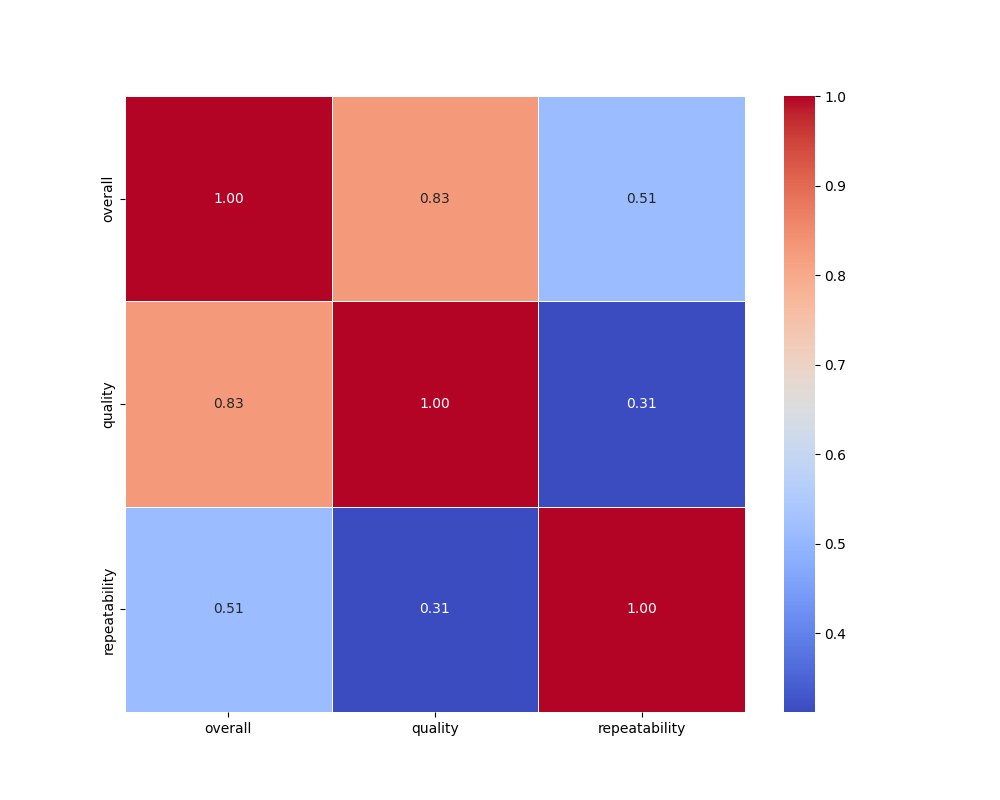
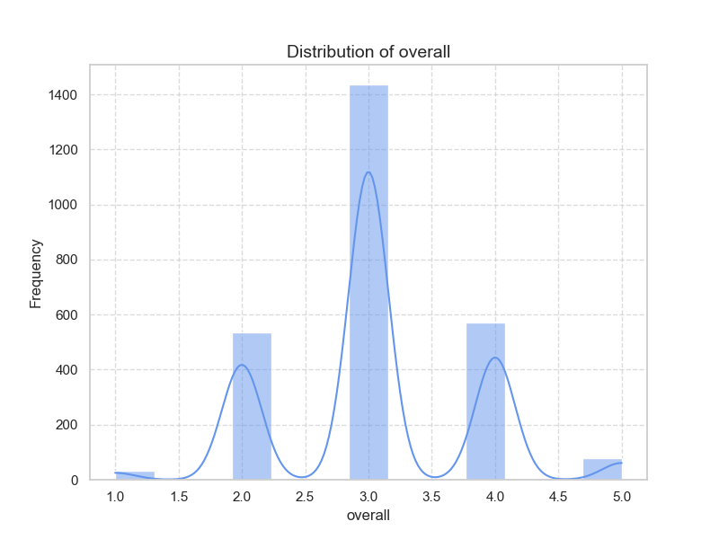
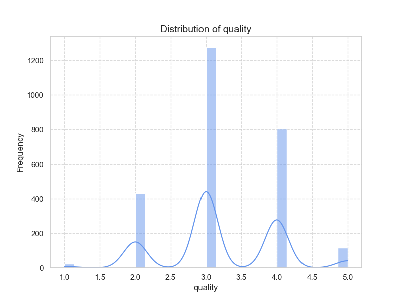
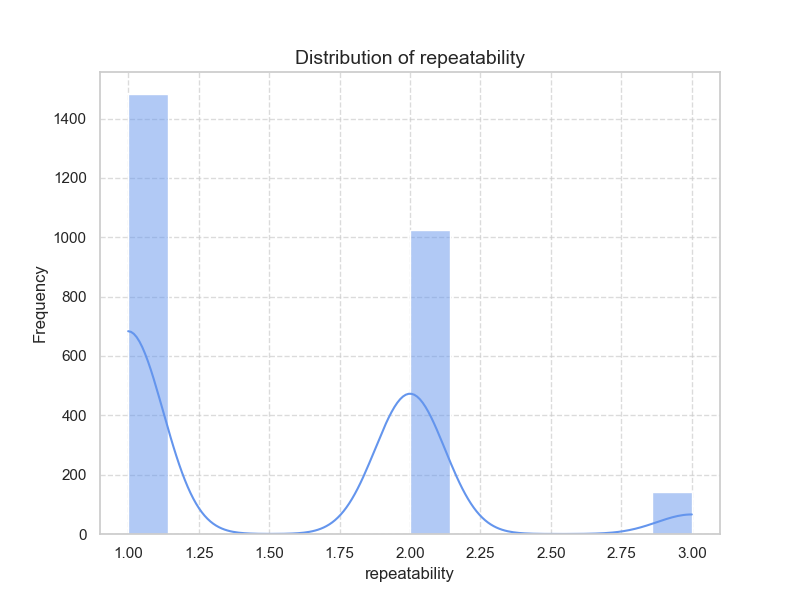

Here's an analysis of the data summarized from the `media.csv` file:

### Summary Statistics:
1. **Date**:
   - Total records: 2553
   - Unique dates: 2055
   - Most frequent date: 21-May-06 (8 occurrences)
   - Presence of NaN values indicates missing dates for some entries.

2. **Language**:
   - Total entries: 2652
   - Unique languages: 11
   - Dominant language: English (1306 occurrences)
   - No missing values, which suggests a comprehensive dataset for language classification.

3. **Type**:
   - Total entries: 2652
   - Unique types: 8
   - Most frequent type: Movies (2211 occurrences)
   - This suggests that the dataset is predominantly focused on movies over other types of media.

4. **Title**:
   - Total entries: 2652
   - Unique titles: 2312
   - Most common title: "Kanda Naal Mudhal" (9 occurrences)
   - Presence of numerous unique titles reflects diversity in the dataset.

5. **By (Creator/Contributor)**:
   - Total entries: 2390 (indicates some missing values)
   - Unique contributors: 1528
   - Most common contributor: Kiefer Sutherland (48 times)
   - High diversity in contributors, though a significant amount of missing data (262 entries).

6. **Overall Ratings**:
   - Mean: 3.05 (on a scale presumably from 1 to 5)
   - Standard Deviation: 0.76
   - Scores are mostly clustered around the mean, with a minimum of 1 and a maximum of 5.

7. **Quality Ratings**:
   - Mean: 3.21
   - Standard Deviation: 0.80
   - Quality scores indicate a similar distribution to overall ratings.

8. **Repeatability**:
   - Mean: 1.49
   - Standard Deviation: 0.60
   - This suggests most entries are rated as non-repeatable (lower scores), which may need further exploration.

### Missing Values:
- A total of 99 missing values in 'date', and 262 missing values in 'by' which suggests that there may be gaps in contributor data.
- Other fields have no missing values, indicating good data quality.

### Correlation Analysis:
- Strong correlation (0.83) between overall ratings and quality ratings suggests that higher quality media tend to receive higher overall ratings.
- Moderate correlation (0.51) between overall ratings and repeatability indicates a reasonable relationship; higher-rated media are likely considered more repeatable.
- Weaker correlation (0.31) between quality ratings and repeatability suggests varying perspectives on repeatability irrespective of quality ratings.

### General Trends:
- The dataset is predominantly composed of English language movies, focusing on a substantial number of unique titles and contributors.
- Overall and quality ratings are generally high, with a statistical tendency towards clustering around the average; however, the low repeatability score suggests that while media may be rated well, they might not be preferred for re-watching.

### Areas Needing Further Analysis:
1. **Exploration of Missing Data**: Investigate the reasons behind the missing values, especially in the 'date' and 'by' columns. Could these missing entries indicate specific patterns in certain types of media or timeframes?
2. **Repeatability and Engagement**: Analyze what traits of the media contribute to low repeatability scores despite high overall/quality ratings. Consider aspects like genre, themes, or length.
3. **Diversity in Language and Titles**: Explore the distribution and trends among the unique languages and titles. Are there patterns in ratings associated with non-English entries?
4. **Impact of Contributors**: A closer examination of how different contributors impact overall and quality ratings. This may involve looking into specific contributors and their body of work.
5. **Temporal Trends**: Trends over time based on the date entries can be analyzed to see if there are any shifts in movie preferences or quality over years.

In summary, the dataset presents a good overview of media ratings, with certain areas such as repeatability and missing data providing opportunities for deeper analysis.

Based on the provided correlation matrix, we can identify the following key correlations:

1. **Overall and Quality**: There is a strong correlation (0.826) between 'overall' and 'quality', suggesting that as the quality increases, the overall ratings tend to increase as well. This relationship could imply that improvements in quality directly enhance the overall perception or satisfaction.

2. **Overall and Repeatability**: There is a moderate correlation (0.513) between 'overall' and 'repeatability'. This indicates that higher repeatability (the ability to produce the same results consistently) is associated with better overall ratings. This suggests that consistency in performance might positively impact users' overall evaluations.

3. **Quality and Repeatability**: The correlation between 'quality' and 'repeatability' is weaker (0.312) but still significant. This indicates that higher quality products may tend to be more repeatable, but the relationship is not as strong as other correlations. This could imply that while improved quality may enhance repeatability, other factors may also influence this characteristic.

### Possible Causal Relationships:

1. **Quality Influences Overall Rating**: The strong correlation between quality and overall suggests that quality improvements can lead to higher overall satisfaction. Businesses should focus on enhancing the quality of their offerings as a strategy to boost overall customer ratings.

2. **Repeatability Affects Overall Rating**: The moderate correlation with overall suggests that improving repeatability can also enhance customer satisfaction. Ensuring consistent performance may be crucial for maintaining high overall ratings.

3. **Quality May Influence Repeatability**: The weaker correlation between quality and repeatability hints at a relationship where improving quality could potentially lead to better repeatability. However, the presence of other factors influencing repeatability must be acknowledged, indicating that this relationship may not be directly causal.

### Key Recommendations:
- Conduct experiments to test the impact of specific quality enhancements on overall satisfaction.
- Implement processes that improve repeatability as a strategy to enhance overall customer experiences.
- Further investigate the factors affecting repeatability to understand how to better align quality with consistent performance.

